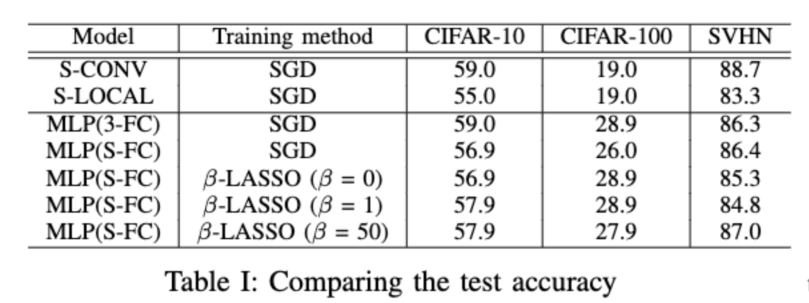

# EE411-Project

[EPFL EE411](https://edu.epfl.ch/coursebook/en/fundamentals-of-inference-and-learning-EE-411) Reproducibility Challenge: Towards learning convolutions from scratch

## Team Members

- Pian Wan, pian.wan@epfl.ch
- Yuheng Lu, yuheng.lu@epfl.ch
- Xinwei Li, xinwei.li@epfl.ch
- Jiaxing Dong, jiaxin.dong@epfl.ch
- Xinyi Han, xinyi.han@epfl.ch

## Quickstart

### Requirements

Python 3.10

```shell
git clone git@github.com:pianwan/EE411-Project.git
cd EE411-Project
pip install -r requirements.txt
```

### Datasets

The datasets can be downloaded directly from `torchvision` datasets. We test our models on `CIFAR-10`, `CIFAR-100`, and `SVHN` datasets.

### Run

```shell
python train.py --config ./configs/sample.txt
```
You can specify the config by using the parameter like `--alpha 100 --epoch 4000`.

## Result



## Project Organization

```text
.
├── README.md
├── config.py
├── configs
│   └── sample.txt
├── dataset
│   ├── __init__.py
│   └── datasets.py
├── metrics.py
├── model
│   ├── __init__.py
│   ├── components.py
│   ├── model.py
│   └── optim.py
├── requirements.txt
├── test.py
├── train.py
├── utils.py
└── visualization.ipynb
```

## Contribution Details
The basic structure of this project is implemented by Pian Wan including the python file of choosing datasets, basic components of networks and train and test fucntions. Yuheng Lu, Xinwei Li, Jiaxin Dong and Xinyi Han implemented the structure of every network for recreating the same experiment. To specify, Yuheng implemented the basic component structure of Local connect layer, SLocal network and Dlocal network. Xinwei and Jiaxin implemented the sconv network, dconv network and MLP (3-FC), MLP (S-FC) and MLP (D-FC) models. Xinyi implemented the optimizer of ${\beta\_LASSO}$ and reviewed all the structures and networks in our work. Then Xinwei implemented code of visualizations for this project (Figure 3, 5, 6, 7 and Table 1). Finally, Xinyi wrote most of this report while all others engaged in writing the parts of their own contribution. For a coarse contribution information to this repository, you can look into https://github.com/pianwan/EE411-Project/graphs/contributors

## Acknowledgements

We thank Neyshabur Behnam for his work _Towards learning convolutions from scratch_. For reference, you can cite his paper and this repository by:

```tex
@article{neyshabur2020towards,
  title={Towards learning convolutions from scratch},
  author={Neyshabur, Behnam},
  journal={Advances in Neural Information Processing Systems},
  volume={33},
  pages={8078--8088},
  year={2020}
}
```

```tex
@misc{wan2024unoffical,
    title={Unofficial implementation of Towards learning convolutions from scratch},
    author= {Wan, Pian and Lu, Yuheng and Li, Xinwei and Dong, Jiaxing and Han, Xinyi},
    year={2024},
    note={https://github.com/pianwan/EE411-Project}
}
```

## Important Notes
This version is not exactly the same as what the original paper do. This is only for EE411 submissions.